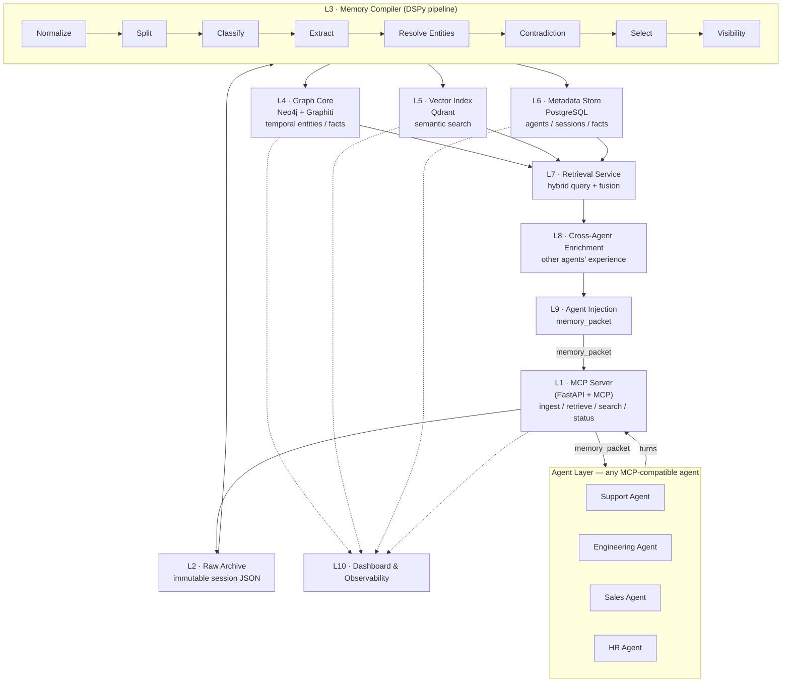

# Federated Agent Memory — Architecture

Component-level view. One diagram, one short line per component.

---

## Component diagram

---

## Components (top to bottom)

| # | Component | What it does |
|---|-----------|--------------|
| **L1** | **MCP Server** | Single entry point for all agents. Exposes `memory_ingest_turn`, `memory_ingest_close`, `memory_retrieve`, `memory_search`, `memory_status`. MCP-native, with a REST fallback for non-MCP agents. |
| **L2** | **Raw Archive** | Immutable store of every raw session (append-only JSON). Source of truth for replay and re-processing. Never modified after write. |
| **L3** | **Memory Compiler** | The brain. An 8-step DSPy pipeline turns raw turns into structured memory events: `Normalize → Split → Classify → Extract → Resolve Entities → Contradiction Check → Select → Visibility`. |
| **L4** | **Graph Core** | Temporal knowledge graph (Neo4j + Graphiti). Entities/facts as nodes with bi-temporal tracking (when true + when recorded). Carries `visibility`, `source_agent`, `agent_group`. |
| **L5** | **Vector Index** | Embeddings for every entity, fact, and episode (Qdrant). Enables semantic search and cross-agent similarity. Collections split private vs shared. |
| **L6** | **Metadata Store** | Relational bookkeeping (PostgreSQL): agent registry, group definitions, sessions, entity registry, fact lifecycle, visibility audit log, compiler job queue. |
| **L7** | **Retrieval Service** | Answers "what memory is relevant *for this agent, right now*?" Runs parallel queries (semantic + graph + metadata), fuses, dedupes, ranks, and builds the packet. |
| **L8** | **Cross-Agent Enrichment** | The flagship. Finds experiences from *other* agents relevant to the current query, scores them, and injects them as "enriched context". |
| **L9** | **Agent Injection** | Formats the final `memory_packet` (your memory / shared team memory / enriched context) and injects it into the agent's system prompt. Token-budget aware. |
| **L10** | **Dashboard** | Live ops view: service health, memory growth, scope distribution, agent activity, quality signals. |

---

## Memory scope model

Every memory event is tagged with a visibility at compile time:

| Scope | Readable by | Example |
|-------|-------------|---------|
| **private** | one agent | "Customer X prefers email over phone" |
| **shared** | agents in same group | "Login bug root cause: stale JWT cache" |
| **global** | all agents | "Enterprise SLA: 4h response for tier-1" |

---

## MVP status

| Piece | Status |
|-------|--------|
| Ingest / Raw Archive / Compiler (7 steps) | ✅ working |
| Graph (Neo4j+Graphiti) / Vector (Qdrant) / Metadata (Postgres) | ✅ working |
| Retrieval + Dashboard | ✅ working |
| MCP Server wrapper | 🔨 to build |
| Visibility Classifier (step 8) | 🔨 to build |
| Federated Retrieval + Cross-Agent Enrichment | 🔨 MVP |
| Multi-tenancy | 📋 post-MVP |
