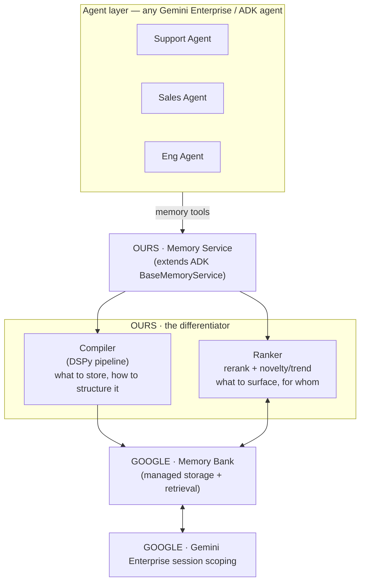

# Federated Agent Memory — Architecture (v2)

> Updated 2026-08-21 after the architecture grooming call. Replaces the previous
> self-built L1–L10 stack. See
> [`openspec/changes/adopt-google-memory-bank`](../openspec/changes/adopt-google-memory-bank/)
> for the change proposal and delta specs.

---

## The one-line idea

We don't build a memory store. We build a **smarter memory service** on top of
Google's managed memory — owning only *what to store* (Compiler) and *what to
surface* (Ranker).

---

## Component diagram

---

## Components

| Component | Owner | What it does |
|-----------|-------|--------------|
| **Agents** | consumer | Any Gemini Enterprise / ADK agent calls memory through the standard Memory Service tools. |
| **Memory Service** | **OURS** | A drop-in memory implementation that extends ADK `BaseMemoryService`. The deliverable. |
| **Compiler** (DSPy) | **OURS** | Turns raw conversation turns into structured memory entries. A DSPy pipeline — what to store, how to structure it. |
| **Ranker** | **OURS** | Reranks retrieved memory for the requesting agent + query, with novelty / trend detection (real-time RAG). |
| **Google Memory Bank** | GOOGLE | Managed memory storage + retrieval. Replaces the self-built graph, vector, and metadata stores. |
| **Gemini Enterprise session scoping** | GOOGLE | Scopes memory per session / agent. Replaces the custom visibility model. |

---

## What changed vs v1

| v1 (self-built, L1–L10) | v2 (Google + our layer) |
|---|---|
| L1 · MCP Server (FastAPI + MCP) | Memory Service extending ADK `BaseMemoryService` |
| L2 · Raw Archive (append-only JSON) | Google Memory Bank |
| L3 · Memory Compiler (8-step DSPy) | **Compiler (DSPy)** — kept, sharpened |
| L4 · Graph Core (Neo4j + Graphiti) | Google Memory Bank |
| L5 · Vector Index (Qdrant) | Google Memory Bank |
| L6 · Metadata Store (PostgreSQL) | Google Memory Bank |
| L7 · Retrieval Service (hybrid + fusion) | Memory Bank retrieval + **Ranker** |
| L8 · Cross-Agent Enrichment | folded into the **Ranker** |
| L9 · Agent Injection | Memory Service return path (ADK) |
| L10 · Dashboard & Observability | GCP logging / Memory Bank observability |
| — visibility scope model | Gemini Enterprise session scoping |

---

## Memory scope model

Unchanged in spirit — `private`, `shared`, `global` — but now enforced through
Gemini Enterprise session scoping rather than custom graph labels.

| Scope | Readable by | Example |
|-------|-------------|---------|
| **private** | one agent | "Customer X prefers email over phone" |
| **shared** | agents in same group | "Login bug root cause: stale JWT cache" |
| **global** | all agents | "Enterprise SLA: 4h response for tier-1" |

---

## Open questions

- Target artifact: Agent Platform Memory Bank vs Vertex AI Memory Bank (exact ADK
  entry point to pin).
- MCP tool surface for non-ADK agents: keep or go ADK-only for the hackathon?
- Novelty trigger: how to measure "trend novelty" concretely (rolling-window
  topic/entity spike)?
