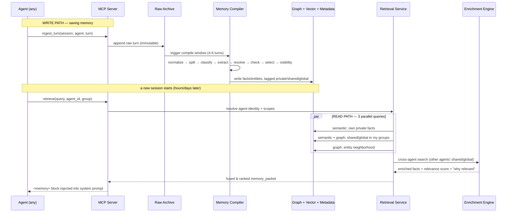

# Federated Agent Memory — Workflow

How memory is **saved**, **retrieved**, and **shared** between agents, and where
the metadata lives.

---

## Full lifecycle (sequence)

---

## Step by step

### 1. Save (write path)
1. Agent streams a turn → MCP server acknowledges immediately (non-blocking).
2. The turn is appended to the **Raw Archive** (immutable JSON).
3. When a window fills (4–6 turns) or a topic shifts, the **Compiler** runs.
4. Compiler extracts structured memory events and tags each with a **visibility scope**.
5. Facts/entities are written to **Graph + Vector + Metadata** in one transaction.

### 2. Retrieve (read path)
1. Agent asks `retrieve(query)` before a session.
2. The server resolves the agent's identity → group membership → readable scopes.
3. Three parallel queries run: own private memory, group shared/global memory, and graph entity neighborhood.
4. Results are fused, deduped, ranked, and truncated to a token budget.

### 3. Share (enrichment path)
1. After the agent's own memory is gathered, the **Enrichment Engine** searches *other* agents' shared/global facts that are semantically similar to the query.
2. Candidates are scored by relevance, recency, source reputation, and cross-references.
3. Top items are injected as **"enriched context"** with a "why relevant" note — the agent inherits institutional knowledge it never saw directly.

---

## Metadata map — what lives where

| Store | Holds | Key metadata |
|-------|-------|--------------|
| **Raw Archive** (filesystem) | immutable session JSON | `session_id`, `source_agent`, `agent_group`, turns, timestamps |
| **Graph** (Neo4j) | entities + facts + relations | `visibility`, `source_agent`, `target_groups`, `status` (active/outdated), `confidence`, `supersedes` links |
| **Vector** (Qdrant) | embeddings | collection per scope (`facts_private`, `facts_shared`), `source_agent` filter, `status` filter |
| **Metadata** (PostgreSQL) | relational bookkeeping | agent registry + group membership, entity aliases, fact lifecycle, visibility audit log, compiler job queue |

---

## Scope rules in one table

| Event | Visibility | Who can read it later |
|-------|-----------|----------------------|
| Agent-specific preference | `private` | only that agent |
| Domain/team solution | `shared` | agents in the same group(s) |
| Org-wide fact / policy | `global` | all agents |
