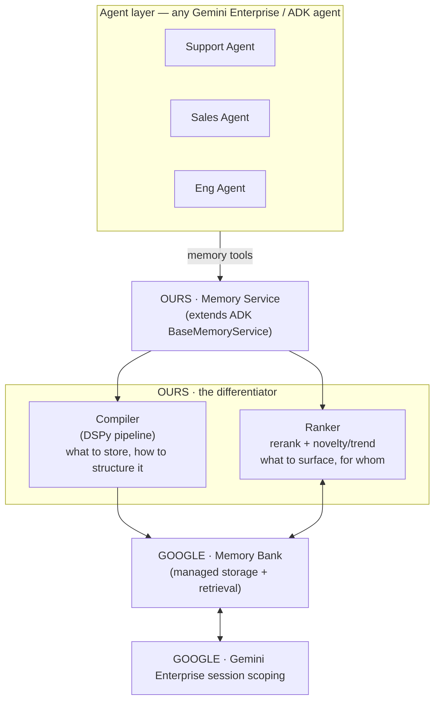

# Design — Adopt Google Memory Bank

## Overview

Rebase the product onto Google's managed memory. We stop building storage and
retrieval, and instead ship a **custom Memory Service** (an ADK extension) that
owns only *what to store* (Compiler) and *what to surface* (Ranker). The
deliverable is a drop-in memory implementation for any Gemini Enterprise / ADK
agent.

## Target architecture

## Google services we build on

| Service | Role |
|---|---|
| **Memory Bank** (Agent Platform / Gemini Enterprise) | managed memory storage + retrieval |
| **ADK `BaseMemoryService`** | the extension point we inherit from |
| **Vertex AI Memory Bank** | reference implementation — the exact pattern we follow |
| **Gemini Enterprise session mechanism** | scoping memory per session / agent |

## What we own (the differentiator)

1. **Compiler (DSPy)** — turns raw turns into structured memory entries. A DSPy
   pipeline of programmatic steps (not a mega-prompt), optimized against labeled
   data. This is the "what do we remember" half.
2. **Ranker** — reranks retrieved memory for the requesting agent + query. This
   is the "what do we surface, and is it *new*" half. Includes novelty / trend
   detection so an agent picks up a fresh signal before a Data Science team has
   rebuilt a RAG index — the **real-time RAG** thesis.

## Customization points

Inherit `BaseMemoryService` and override:

1. **Memory creation** → routed through our Compiler.
2. **Memory retrieval / ranking** → routed through our Ranker.
3. *(optional)* **Session policy** → map our `private` / `shared` / `global`
   scopes onto Gemini Enterprise session scoping.

## Open decisions (architect)

- Which concrete artifact do we target first: **Agent Platform Memory Bank** or
  **Vertex AI Memory Bank**? (The call leaned on the ADK `BaseMemoryService`
  inheritance pattern; need to pin the exact SDK entry point.)
- Do we keep an MCP tool surface for non-ADK agents, or go ADK-only for the
  hackathon demo?
- Ranker novelty trigger: how do we define and measure "trend novelty"
  concretely (e.g., spike in a topic / entity over a rolling window)?

## Technology

- **Language / framework:** Python, Google ADK (`google-adk`).
- **Compiler:** DSPy (unchanged from v1, now the *only* custom pipeline).
- **Storage / retrieval:** Google Memory Bank (no Neo4j, Qdrant, or PostgreSQL).
- **Deployment:** GCP Cloud Run (unchanged target).
