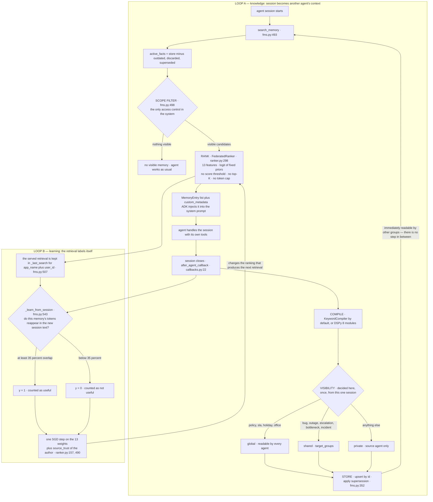

# Hypothesis 2 — Federated scoped memory (the POC loop)

This is a **documentation pack, not an implementation slice**. Nothing here is
imported by anything, and it adds no code and no spec.

It documents the loop that the working POC actually runs, in the same shape as
[H1](../h1-experience-cards/README.md), so the two flows can be compared directly
instead of from memory — and it checks that loop against this repository's own
specs in [§6](#6-conformance-against-this-repositorys-own-specs).

Every claim is taken from the POC source, not from a design document. File and
line references are given so a reviewer can check each step. `fms.py` below is
shorthand for `federated_memory_service.py`.

## 0. Where the code is

The POC is not in this repository. It lives in the internal GitLab mirror:

```
git.garage.epam.com/federated-agent-memory/federated-agent-memory
  POC/federated_memory_service.py    the loop: scope filter, compile hook, implicit labelling
  POC/dspy_compiler.py               8-module compiler, deterministic fallbacks
  POC/ranker.py                      13 features, priors, online logistic regression, entity graph
  POC/callbacks.py                   after_agent_callback — without it nothing is written
  POC/run_demo.py                    offline demo, no credentials needed
  POC/design/                        solution overview, ranking, DSPy pipeline
```

Read against `main` at `82c77dd`. The run in [§5](#5-evidence-from-a-real-run) is
from that tree, `python run_demo.py` with `google-adk` installed and no API key.

## 1. The hypothesis

> If every finished agent session is compiled into scoped memory events, and a
> federation-aware ranker decides what each asking agent sees, then an agent
> receives useful knowledge produced by other agents that it never stored itself
> — and A2A does not have to carry that knowledge.

Two claims are bundled, and they succeed or fail independently:

| # | claim | owned by |
|--|--|--|
| **H2a** | **scoping** — three levels (`private` / `shared` / `global`) plus agent groups are enough to govern cross-agent reuse | compiler + service |
| **H2b** | **ranking** — usefulness *to this agent* (complementarity, enrichment gain, source trust) beats plain relevance, and can be learned from implicit signals | ranker |

H2a is what makes the demo work. H2b is what `design/ranking.md` calls the
differentiator. Only H2a currently has any evidence.

## 2. The loop

Unlike H1, this loop has **no accumulation phase**. Visibility is decided once,
at write time, from a single session, and it is final. There are two loops, and
the second is closed on the output of the first.



The edge to read twice is the one from `SGD` back into `RANK`. The label that
trains the ranker is measured on the text of a session whose prompt that same
memory was injected into. H1 names this effect `echo` and subtracts it explicitly
(`h1-experience-cards/SPEC.md` §5.1); here it is the training signal.

### 2.1 Inside COMPILE

Two different logics behind one interface, selected by a flag:

```
A) KeywordCompiler — default, no LLM, no quality gate at all
   fms.py:106 · every non-empty turn becomes one memory event
     text     = the raw turn text, unmodified
     entities = every word starting with a capital letter
     id       = uuid4()  ← re-compiling the same session creates new rows
     visibility:
       policy | sla | holiday | office                    → GLOBAL
       bug | outage | escalation | bottleneck | incident   → SHARED
                                                            targets = the source
                                                            agent's readable_groups
       otherwise                                          → PRIVATE

B) DspyCompilerPipeline — --use-dspy, 8 modules, each LLM step has a
   deterministic fallback · dspy_compiler.py:610
     1 normalize turns
     2 split into episodes
     3 classify type + confidence   ── < 0.6 → episode dropped      GATE 1
     4 extract memory items         ── empty → dropped
     5 resolve entities             rapidfuzz + canonical id registry
     6 contradiction check          near-identical text, fuzz.WRatio >= 94
                                    → discarded + superseded_by
                                    otherwise → active
     7 selector: keep status=active only                            GATE 2
     8 classify visibility per event ── < 0.6 → dropped             GATE 3
         LLM answer if it parses, otherwise THE SAME KEYWORD TABLE as A
```

Note on A: `target_groups` is set to the *source* agent's `readable_groups`
(`fms.py:126`) — the groups that agent may read *from*, used as the audience that
may read this event. Read-permission is being used as write-audience. In the demo
this happens to produce the intended result because of how `AGENT_REGISTRY` is
configured; it is not the same thing as choosing an audience.

## 3. Where the loop actually decides

Five decision points, with the values that are in the code today:

| # | decision | mechanism | value | where |
|--|--|--|--|--|
| 1 | is this turn worth remembering | none in the default compiler; episode confidence in DSPy | `min_confidence = 0.6` | `dspy_compiler.py:628` |
| 2 | **who may read it** | keyword table, or LLM with that same table as fallback | `policy/sla/holiday/office → global`, `bug/outage/escalation/bottleneck/incident → shared` | `fms.py:111`, `dspy_compiler.py:519` |
| 3 | is it a duplicate | fuzzy text match only | `fuzz.WRatio >= 94` | `dspy_compiler.py:440` |
| 4 | what the asking agent sees | scope filter, then ranker sort | no threshold, no cap | `fms.py:498`, `ranker.py:298` |
| 5 | was it useful | implicit token overlap | `>= 35%` of the memory's tokens reappear in the next session | `fms.py:558` |

Decision 2 carries the business risk: one pass, one session, final.

The priors that drive decision 4 (`ranker.py:49`):

```
semantic 2.0 · enrichment_gain 1.9 · complementarity 1.5 · audience_fit 1.4
entity_overlap 1.3 · relation_proximity 1.0 · source_trust 0.8 · keyword 0.7
usage_prior 0.6 · recency 0.5 · is_shared 0.35 · is_private 0.25 · is_global 0.15
```

`enrichment_gain` as the second-strongest weight is deliberate — the stated point
is cross-agent knowledge, not time-decayed private search.

## 4. What the loop deliberately does not do

Stated plainly so nobody assumes it is there:

- **No confirmation stage.** One session can publish to another group. No vote, no
  quorum, no "seen twice".
- **No lifecycle.** A memory has two states, active and superseded. Nothing
  expires; nothing can be retired for being wrong.
- **No explicit feedback.** A consumer cannot mark a memory wrong or stale. The
  only signal is the implicit one in LOOP B, and it is positive-only.
- **No same-story merge.** Deduplication is near-verbatim, so two paraphrases of
  one incident become two independent shared memories and both get injected.
- **No PII pass.** `MemoryEvent.text` is the raw turn text.
- **No retrieval budget.** Everything visible is returned, ranked.
- **No eval harness.** No number can currently show whether the ranking or the
  learning works; `design/ranking.md` §4.4 lists the eval set, calibration and
  `min_examples_for_learned` as post-MVP.
- **No raw archive.** Sessions are compiled directly and the transcript is not
  retained, so nothing can be re-compiled later with a better compiler.

## 5. Evidence from a real run

`python run_demo.py` — four compiled memories in the store, support agent asks
`"Customer X login issues"`:

```
score=8.37  [shared,  ENRICHED] "Login bug incident: Customer X root cause is stale JWT cache."   ← engineering_agent
score=7.32  [shared,  ENRICHED] "Customer X is furious about repeated login bugs ..."             ← sales_agent
score=5.54  [private, own]      "Customer X prefers email, not phone calls."                      ← support_agent
score=4.25  [shared,  ENRICHED] "Billing dispute escalation is a bottleneck this quarter."        ← sales_agent

HR Agent (not in the sales/support groups), same query: 0 results
```

Three findings, and they are not all good news:

1. **H2a works as advertised.** Support received engineering's diagnosis without
   ever storing it and without an A2A call. Isolation holds — HR gets nothing.
2. **Decision 4 has no filter.** The billing memory is unrelated to the query and
   still reaches the prompt. There is an order, but no admission test.
3. **Decision 2 fired on one word.** Both cross-agent memories became `shared`
   because a single turn contained `incident` or `escalation`.

`python run_demo.py --use-ranker`, then one implicit label (login/JWT marked
useful) and one SGD step:

```
source_trust  engineering_agent  0.80 → 0.92
source_trust  sales_agent        0.80 → 0.62
source_trust  support_agent      0.55 → 0.22      ← the agent's own memory
```

One feedback event moves author trust by tens of percent. `source_trust` is
`0.4 × tier_prior + 0.6 × used/retrieved` with no smoothing (`ranker.py:490`);
`design/ranking.md` §4.3 already asks for smoothing at low counts. The ranking
order did not change in this run.

Incidentally: `--use-ranker` does not switch the ranker. `FusionRanker =
LearnedRanker = FederatedRanker` (`ranker.py:524`) and `create_ranker` always
returns `FederatedRanker`; the flag only toggles `cfg.online_learning`.
`SimpleRanker` (`fms.py:175`) is dead code. The README implies a choice that does
not exist.

## 6. Conformance against this repository's own specs

The POC is an implementation of components this repository already specified. That
makes conformance checkable rather than a matter of taste. `MET` / `PARTIAL` /
`NOT MET` below refer only to the POC as it stands today.

### 6.1 `openspec/specs/visibility-classifier/spec.md`

| requirement | POC behaviour | verdict |
|--|--|--|
| Scope classification — assign exactly one scope **and record a confidence score** | assigns one scope; records `visibility_reasoning` as free text, no confidence for the visibility decision. The `0.6` gate is on *extraction* confidence, a different quantity | PARTIAL |
| Shared target groups — assign one or more, outsiders must not read | assigned and enforced (`fms.py:498`); empty list defaults to the source group (`dspy_compiler.py:548`) | MET |
| **Default to private on uncertainty** — below-threshold or ambiguous → `private` | no visibility confidence exists, so this rule can never fire; the keyword table always returns a definite answer | NOT MET |
| **Global classification audit** — audit entry, visible in the audit log | `visibility_reasoning` in `custom_metadata` only; no audit log, no dashboard | NOT MET |
| **Sensitive-topic blocklist** — salary, medical, legal, PII → `private` regardless | absent. Worse, the inverse is live: the `global` keyword list contains `policy`, so a sentence about a *legal policy* is classified org-wide | NOT MET |
| **Fail closed** — classifier errors or times out → `private` | the exception is caught (`dspy_compiler.py:529`) and control falls through to the keyword table, which can return `shared` or `global`. It fails **open** | VIOLATED |

The last row is the one worth a decision before this loop touches real traffic:
the spec says fail closed, the implementation fails open, and the failure path is
the *normal* path whenever no LM is configured.

### 6.2 `openspec/specs/cross-agent-enrichment/spec.md`

| requirement | POC behaviour | verdict |
|--|--|--|
| Fixed scoring formula `0.40 semantic + 0.25 graph + 0.15 recency + 0.10 reputation + 0.10 cross_reference`, range 0–1 | replaced by a 13-feature logistic score, unbounded (8.37 observed). This is a *deliberate* redesign — `design-evolution-comparison.md` argues the learned ranker is the defensible version — but no `openspec/changes/` proposal was ever filed | DIVERGED, spec not updated |
| **Inclusion threshold `0.70`** — below it, exclude | no threshold of any kind | NOT MET |
| Cross-agent scope — never the requesting agent's own memory | own memories are returned in the same ranked list, flagged `enrichment: false` (§5, rank 3). There is no separate enrichment stage; L7 and L8 are merged | NOT MET as written |
| **Item cap 5** | no cap | NOT MET |
| Cold start — `source_reputation` defaults to neutral `0.5` | derived from `trust_tier` instead: a `trusted` agent starts at `0.8`, an unknown one at `0.55` | DIVERGED |
| Cold start — `cross_reference` = `0.0`, do not penalise | the feature does not exist; `design/ranking.md` §4.3 lists it as post-MVP | MISSING |

### 6.3 Process note

Per `openspec/AGENTS.md`, changed behaviour needs a change folder, not a silent
drift. Two are missing and this pack does not create them — that is a separate
proposal:

1. `changes/replace-fixed-enrichment-formula/` — the learned ranker replacing the
   fixed formula, with the threshold and cap questions answered rather than
   dropped.
2. `changes/visibility-fail-closed/` — the fail-closed requirement, the blocklist
   and the `global` audit trail, since the current fallback contradicts the spec.

### 6.4 Divergence from `docs/03-workflow.md`

The intended lifecycle and the implemented one differ in five places:

| `docs/03-workflow.md` | POC |
|--|--|
| Raw Archive keeps immutable turns; the compiler runs off it | no archive; sessions compile directly and the transcript is dropped |
| compile window of 4–6 turns or a topic shift | whole session at once, at session end |
| three parallel queries, then fuse, dedupe, truncate to a token budget | one in-process filter and sort; no dedupe, no budget |
| separate Enrichment Engine, injected as an `enriched context` block with a "why relevant" note | merged into the main ranking; "why" is feature values in metadata, no note |
| Graph + Vector + Metadata written in one transaction, with a visibility audit log | one SQLite table; no audit log |

None of these is fatal for a demo. The first one is the one with a long tail: with
no raw archive, every compiler improvement applies only to future sessions.

## 7. How to falsify H2

H2a and H2b need different tests, and only H2a currently has any.

**H2a — scoping**
- an agent outside the target groups receives 0 — covered by `run_demo.py`;
- a `private` memory must not influence another agent's ranking — **fails today**:
  `search_memory` calls `set_corpus(active_facts)` *unfiltered* (`fms.py:504`) and
  `set_corpus` rebuilds the entity co-occurrence graph (`ranker.py:294`), so
  `relation_proximity` (prior 1.0) is computed over other agents' private
  memories. `design/solution-overview.md` §6.1 claims the opposite invariant;
  `design/ranking.md` §4.2 admits the gap and defers it;
- a paraphrase of an existing memory must not produce a second servable copy —
  **fails today**, deduplication is near-verbatim only.

**H2b — ranking.** None of these can be answered yet, and that is the real gap:
- does the intended cross-agent memory outrank the agent's own redundant note?
  (`design/ranking.md` §5 criterion 1 — no harness exists);
- after N implicit labels, does held-out ranking beat the cold-start priors, or
  drift? (criterion 3 — no held-out set exists);
- what share of injected memories is unrelated to the query? From §5 it is 1 in 4
  on a four-item store, which is the only measurement that exists.

Minimum to make H2b falsifiable: a frozen query set with known-useful memories, a
score threshold so precision is defined at all, and online learning **off by
default** until it can be measured.

## 8. What this pack still needs

H1 reached a decidable state because the plan came before the code. To match it,
H2 needs the same four artefacts, and none of them exist yet:

| missing | why it matters |
|--|--|
| `EVAL-PLAN.md` | H2b has no metric, no baseline and no floor/ceiling audit |
| `RUN-PROTOCOL.md` | the run in §5 is a hand-run demo, not a recorded run with a manifest |
| `CHECKS.md` | the six `NOT MET` rows in §6 would each be a HARD contract check |
| a frozen input pack | H1 has 1000 pooled + 200 hold-out dialogues; H2 has four hand-written sentences |

Until then, H2a should be read as *demonstrated*, and H2b as *unmeasured* — not as
validated.

## 9. Relation to H1

The two experiments are not two versions of one thing. They put the decision in
different places:

|  | H1 · experience cards | H2 · federated scoped memory |
|--|--|--|
| question answered | may this knowledge be reused? | how does knowledge reach the agent? |
| decided by | count of independent dialogues | a classifier, once |
| decided when | after N chats, at promotion | at write time, per session |
| unit of memory | 4-field card, ≤12 words per field | free-text `MemoryEvent` |
| gate to being served | `votes >= 2` from independent agents | `visibility ∈ {shared, global}` |
| retrieval | TF-IDF, threshold `0.18`, max 3 cards | 13-feature logit, no threshold, no cap |
| death | feedback `wrong`, or 30 days quiet | none |
| feedback | explicit, cites a `card_id` | implicit token overlap |
| framing to the agent | evidence, explicitly not a policy | context to inform responses |
| isolation | `tenant_id` + `vertical`, hard equality | agent groups inside one org |
| failure mode | serves nothing (inert) | serves the wrong thing confidently |

They are complementary rather than competing: H1 has no delivery path into ADK,
H2 has no promotion gate. The obvious composition — H1's vote gate placed between
H2's compiler and its store, so the visibility classifier *proposes* and evidence
*decides* — is out of scope here and should be its own proposal.
